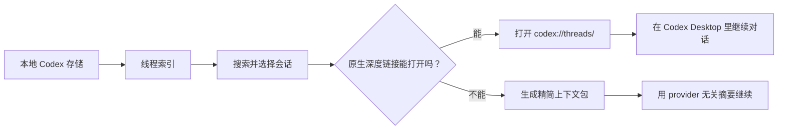

# Codex 桌面版会话恢复方案

这个仓库整理的是一个实用方案：当 Codex Desktop 切换模型供应商或模型之后，旧会话在侧边栏里看起来“消失”时，如何尽量低成本地找回并继续原来的上下文。

核心思路：

> 优先使用 Codex Desktop 原生的会话深度链接恢复；只有原生恢复失败时，才导出精简上下文包作为兜底。

这样做可以避免把很长的历史对话重新塞给新模型读取。只要 Codex Desktop 能直接打开原来的线程，就让桌面端加载本地会话状态。

## 解决的问题

- 切换 provider 或模型后，旧会话不在侧边栏显示。
- 侧边栏或恢复列表只显示一部分历史线程。
- 把完整 transcript 重新喂给新模型很慢，也很耗 token。
- 不同模型供应商之间的 provider 状态不一定能无缝迁移。

## 方案概览

1. 从本地元数据和 session 日志建立 Codex 线程索引。
2. 搜索并选择要恢复的目标会话。
3. 打开 Codex 原生线程链接：

   ```text
   codex://threads/<thread-id>
   ```

4. 如果原生线程能打开并继续对话，就直接在 Codex Desktop 里续聊。
5. 只有原生续聊失败时，才生成 provider 无关的精简上下文包。

## 快捷用法

如果本地已经安装 `Codex 会话恢复` skill，最简单的自然语言调用方式是：

```text
会话恢复：codex://threads/<thread-id>
```

这个 skill 会解析 thread id，优先打开 Codex Desktop 原生深度链接；除非原生恢复失败，否则不会默认导出长篇历史对话。

也可以这样说：

- `会话恢复：codex://threads/<thread-id>`
- `帮我打开 codex://threads/<thread-id>`
- `先确认这个会话是否存在：codex://threads/<thread-id>`
- `复制这个会话的深度链接：<thread-id>`

## 为什么更省 token

深度链接恢复让 Codex Desktop 自己加载本地线程状态。当前模型只需要理解“打开这个线程”的指令，不需要把完整历史对话作为 prompt 重新读取，所以 token 消耗很低。

精简上下文包只作为兜底方案，用在深度链接无法打开、provider 状态不兼容、本地线程状态缺失等情况。

## 仓库内容

- [完整方案](docs/solution.md)：原理、结构和恢复流程。
- [验证记录](docs/validation-notes.md)：支持该方案的本地验证结论。
- [隐私说明](docs/privacy.md)：发布前删除或脱敏的内容。
- [上传检查清单](docs/upload-checklist.md)：公开发布前的安全检查。
- [公开版 Skill](skills/codex-thread-recovery)：可复制到本地 Codex skills 目录使用。
- [截图](screenshots)：已脱敏的方案图和流程图。
- [工具](tools)：用于重新生成截图页面的辅助脚本。

## 目录分层

```text
docs/                         方案说明和验证记录
skills/codex-thread-recovery/ 公开版 Codex 会话恢复 skill
screenshots/                  脱敏后的方案截图
screenshot-pages/             生成截图用的 HTML 源文件
tools/                        辅助脚本
```

## 原理图




## 当前状态

这是一个本地、保守、低风险的恢复方案。默认路径不需要修改 Codex 数据库。修复元数据可见性属于更高风险的独立方案，不放在默认流程里。
