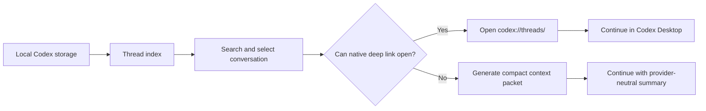

# Codex Context Recovery Solution

This repository provides a practical solution for recovering Codex Desktop conversations after switching model providers.

The core idea is:

> Use Codex Desktop's native deep links as the primary recovery path, and use compact context packets only as a fallback.

This avoids the token cost of forcing a new model to read a long transcript when Codex Desktop can reopen the original thread directly.

## What This Solves

- Conversations appear missing after provider switching.
- The sidebar or resume list may not show all historical threads.
- Re-feeding full transcripts to a new model is slow and token-heavy.
- Provider-specific state may not be portable across model vendors.

## Solution Summary

1. Index local Codex threads from local metadata and session logs.
2. Search and select the target conversation.
3. Open the native thread link:

   ```text
   codex://threads/<thread-id>
   ```

4. Continue in Codex Desktop when the native thread opens successfully.
5. Generate a compact provider-neutral context packet only when native continuation fails.

## Why This Is More Efficient

Deep-link recovery lets Codex Desktop load its own local thread state. The current model does not need to ingest the full conversation as prompt text, so token usage stays low. The fallback context packet is reserved for edge cases such as provider mismatch, encrypted context incompatibility, or missing local thread state.

## Contents

- [Solution](docs/solution.md): complete principle, architecture, and recovery flow.
- [Validation Notes](docs/validation-notes.md): local validation results that support the solution.
- [Privacy Notes](docs/privacy.md): what was removed or masked before publishing.
- [Upload Checklist](docs/upload-checklist.md): safe publishing checklist.
- [Screenshots](screenshots): sanitized solution diagrams and workflow images.
- [Tools](tools): helper for regenerating the sanitized screenshots.

## Principle Diagram




## Status

This is a local, conservative recovery solution. It does not require editing Codex databases for the default path. Metadata repair remains a separate higher-risk option and is intentionally outside the default workflow.
