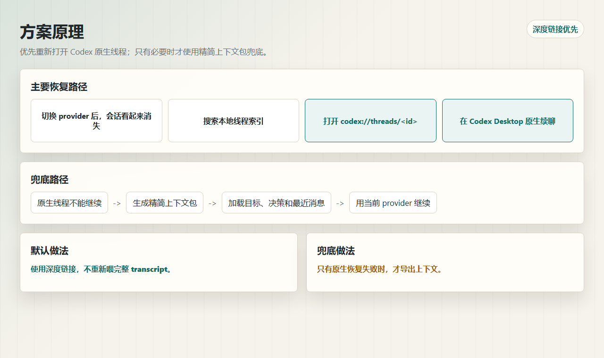
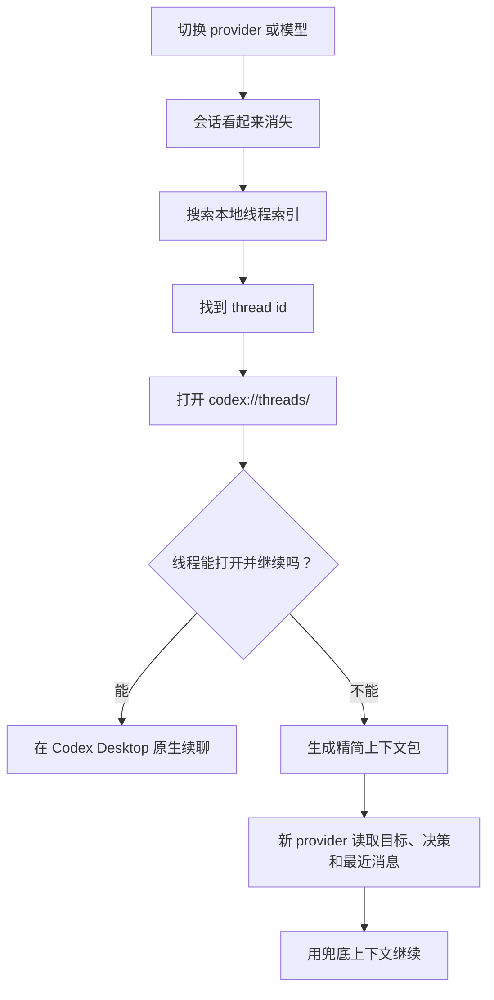
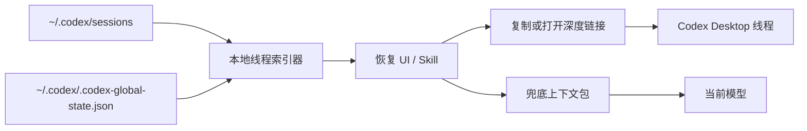

# 方案说明

## 问题

切换 Codex 模型供应商或模型之后，旧会话可能会从侧边栏或恢复列表里消失。很多情况下，本地线程数据其实还在，只是 Codex Desktop 当前展示的线程列表、provider 元数据或恢复状态没有把它显示出来。

最笨也最贵的办法，是把完整历史对话导出后再喂给新模型。这个办法能用，但速度慢、token 消耗高，而且当 Codex Desktop 可以原生打开旧线程时，并没有必要这样做。

## 核心原理

Codex Desktop 已经有原生线程地址格式：

```text
codex://threads/<thread-id>
```

如果本地线程可以通过这个 URI 重新打开，就应该优先让 Codex Desktop 自己恢复线程，而不是把整段上下文重新构造成 prompt。

## 方案原理图





## 结构



## 恢复流程

1. 扫描本地 Codex 元数据和 session 日志。
2. 按提示词、provider、项目路径、修改时间或 thread id 搜索。
3. 选择目标线程。
4. 打开或复制：

   ```text
   codex://threads/<thread-id>
   ```

5. 如果 Codex Desktop 能打开原线程并继续发消息，到这里就停止，不再导出上下文。
6. 如果原生续聊失败，再生成精简上下文包。

## 自然语言调用 skill

对于本地 `Codex 会话恢复` skill，可以直接在聊天里输入：

```text
会话恢复：codex://threads/<thread-id>
```

工具应该把这句话理解成“深度链接优先”的恢复请求：

1. 从复制的 Codex Desktop 链接中提取 `<thread-id>`。
2. 尽量确认目标线程是否存在于本地。
3. 打开或复制 `codex://threads/<thread-id>`。
4. 只有原生恢复不能继续时，才生成精简上下文包。

这条路径最短，也最省 token：模型只接收恢复指令，真正的旧会话状态由 Codex Desktop 通过原生链接加载。

## 为什么省 token

深度链接恢复不会要求新模型读取完整历史对话。它让 Codex Desktop 恢复原来的线程界面和本地状态。

只有原生恢复不能继续时，才需要导出上下文。即使要导出，也应该尽量精简：

```text
1. 当前目标
2. 关键决策
3. 用户约束
4. 最近几轮原始消息
5. 完整 transcript 只作为本地归档，不默认塞进 prompt
```

## 模式

### 模式 1：原生深度链接

默认模式。

优点：

- token 消耗最低。
- 保留原来的 Codex Desktop 会话界面。
- 避免长 prompt 注入。
- 即使线程不在当前侧边栏，也可以直接定位。

### 模式 2：精简上下文包

兜底模式。

适用场景：

- 深度链接打不开目标线程。
- 线程能打开，但当前 provider 不能继续。
- provider 相关的加密内容或响应状态不兼容。

### 模式 3：元数据修复

可选的高风险模式。

这种方式可能需要编辑 provider 元数据、全局状态或 SQLite 记录。它可能改善侧边栏可见性，但不是默认方案必须步骤，也不一定能解决 provider 续聊兼容问题。

## 推荐工具行为

本地 skill 或辅助工具应该：

- 只读取本地 Codex 元数据。
- 建立可搜索的线程索引。
- 显示线程标题、provider、修改时间和最近提示词片段。
- 把“打开深度链接”和“复制深度链接”作为主要操作。
- 把“生成兜底上下文包”作为次要操作。
- 默认不修改 `.codex` 状态。

## 判断规则

```text
codex://threads/<thread-id> 能打开原线程吗？
  能   -> 原生续聊
  不能 -> 生成精简上下文包

打开后的线程能用当前 provider 继续吗？
  能   -> 不需要导出
  不能 -> 生成精简上下文包
```
