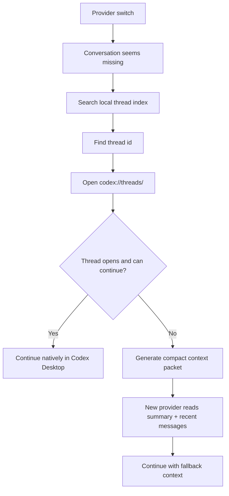
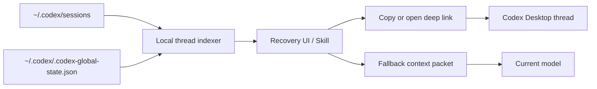

# Solution

## Problem

After switching Codex model providers, older conversations may appear to disappear from the sidebar or resume list. In many cases, the local thread data still exists, but Codex Desktop's visible thread list, provider metadata, or recovery state does not surface it.

The expensive workaround is to export the full transcript and feed it to the new model. That works, but it is slow, token-heavy, and unnecessary when Codex Desktop can reopen the original thread natively.

## Core Principle

Codex Desktop already has a native address format for threads:

```text
codex://threads/<thread-id>
```

If a local thread can be reopened by this URI, the conversation should be recovered through Codex Desktop itself instead of rebuilding the entire context in a prompt.

## Solution Principle Diagram




## Architecture



## Recovery Flow

1. Scan local Codex metadata and session logs.
2. Search by prompt text, provider, project path, modified time, or thread id.
3. Select the target thread.
4. Open or copy:

   ```text
   codex://threads/<thread-id>
   ```

5. If Codex Desktop opens the original thread and messages can continue, stop there.
6. If native continuation fails, generate a compact context packet.

## Why This Saves Tokens

Deep-link recovery does not ask the new model to read the full conversation. It lets Codex Desktop restore the native thread surface and local state.

Context export is only needed when native recovery cannot continue. Even then, the packet should be compact:

```text
1. Current goal
2. Important decisions
3. User constraints
4. Recent original messages
5. Full transcript as local archive, not default prompt
```

## Modes

### Mode 1: Native Deep Link

Default mode.

Benefits:

- Lowest token cost.
- Keeps the original Codex Desktop conversation surface.
- Avoids long prompt injection.
- Can target threads that are not visible in the current sidebar list.

### Mode 2: Compact Context Packet

Fallback mode.

Use when:

- The deep link cannot open the target thread.
- The thread opens but the current provider cannot continue it.
- Provider-specific encrypted content or response state is incompatible.

### Mode 3: Metadata Repair

Optional higher-risk mode.

This may involve editing provider metadata, global state, or SQLite records. It can improve visibility in the sidebar, but it is not required for the default solution and may not solve provider-specific continuation issues.

## Recommended Tool Behavior

A local skill or helper tool should:

- Read local Codex metadata only.
- Build a searchable thread index.
- Show thread title, provider, modified time, and recent prompt snippets.
- Offer "Open Deep Link" and "Copy Deep Link" as primary actions.
- Offer "Generate Fallback Packet" as a secondary action.
- Avoid modifying `.codex` state by default.

## Decision Rule

```text
Can codex://threads/<thread-id> open the original thread?
  yes -> continue natively
  no  -> generate compact context packet

Can the opened thread continue with the current provider?
  yes -> no export needed
  no  -> generate compact context packet
```
