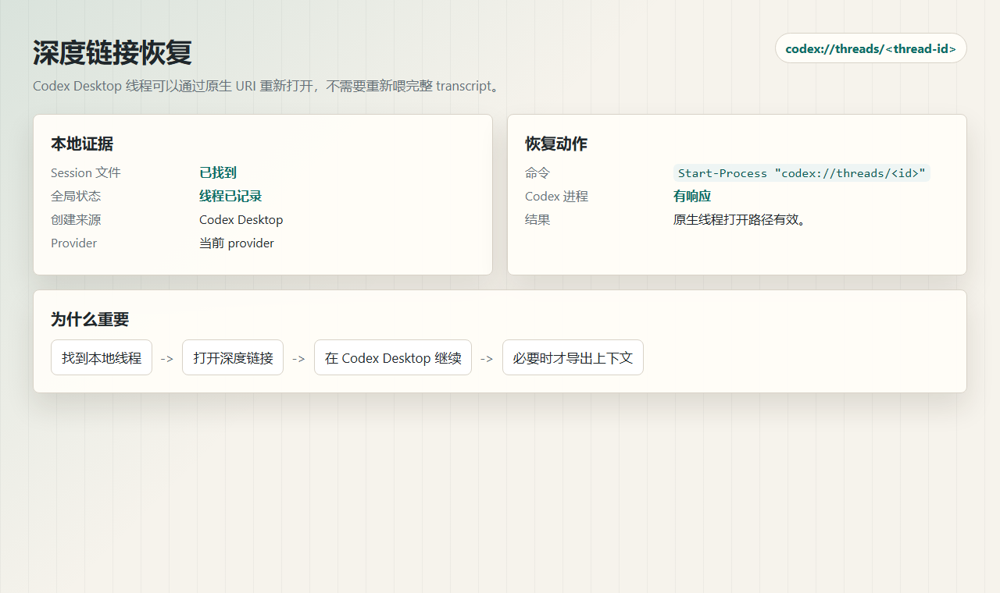
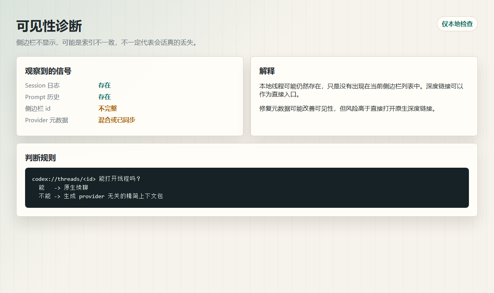
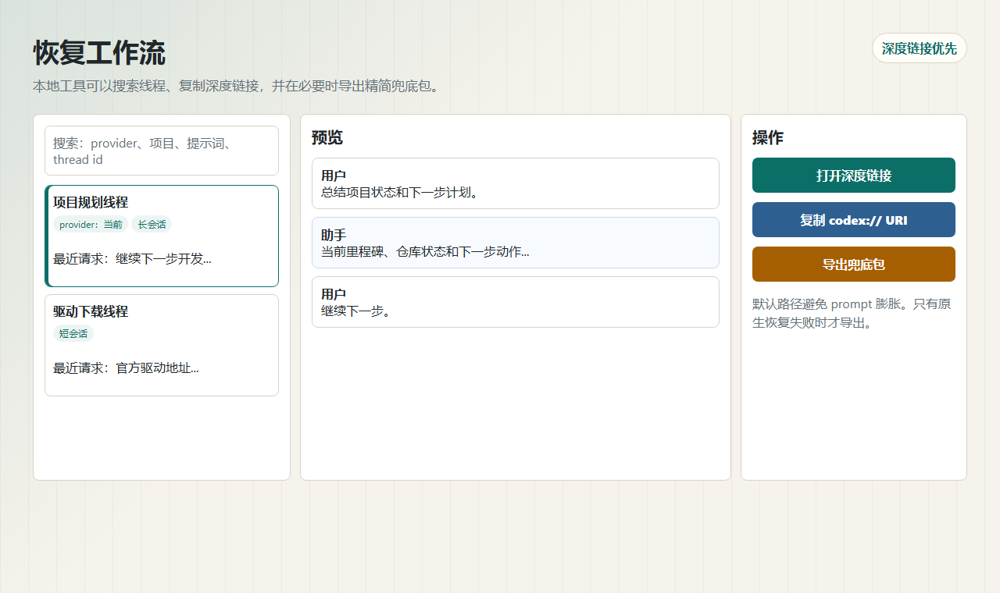

# 验证记录

这些记录总结了支持本方案的本地验证结果。内容已经脱敏，不包含原始 Codex 日志、数据库内容、凭据或完整本地路径。

## 验证 1：原生深度链接可以打开线程

验证的 URI 形式：

```text
codex://threads/<thread-id>
```

观察结果：

- 匹配的本地 session 文件存在。
- thread id 出现在本地 Codex 状态里。
- session 元数据显示它由 Codex Desktop 创建。
- 打开 URI 后，Codex Desktop 有响应。

结论：

原生深度链接可以作为直接进入旧会话的恢复入口。

截图：



## 验证 2：侧边栏不显示不等于数据丢失

本地状态显示：即使当前侧边栏列表没有显示全部历史线程，线程仍可能存在于 session 日志和 prompt 历史中。

观察状态：

```text
本地 session 日志：存在
prompt 历史：存在
侧边栏线程列表：不完整
provider 元数据：可能不同，也可能已经同步
```

结论：

这个问题通常更像是可见性或索引不一致，而不是已经确认的会话数据丢失。

截图：



## 验证 3：较早的长线程也能通过深度链接定位

从本地历史中选择了一个较早的长项目线程，并通过它的原生深度链接打开。

观察结果：

- 目标 session 文件存在。
- 文件体积显示这是一个较长会话。
- thread id 出现在本地 prompt 历史中。
- 打开深度链接后 Codex Desktop 有响应。

结论：

深度链接可以恢复历史本地线程，不需要让模型重新读取完整 transcript。

## 验证 4：上下文包可以作为兜底

本地兜底流程可以从 session 日志生成 Markdown/JSON 续聊包。

观察结果：

- 上下文包可以包含目标、决策、最近消息和完整本地归档。
- 当原生线程不能继续时，它可以作为兜底。
- 对于长对话，它不如深度链接恢复省 token。

结论：

上下文包应该作为兜底，而不是默认恢复路径。

截图：



## 最终结论

推荐流程：

```text
搜索本地线程
  -> 打开 codex://threads/<thread-id>
  -> 能原生续聊就直接继续
  -> 只有原生续聊失败时，才导出精简上下文包
```
